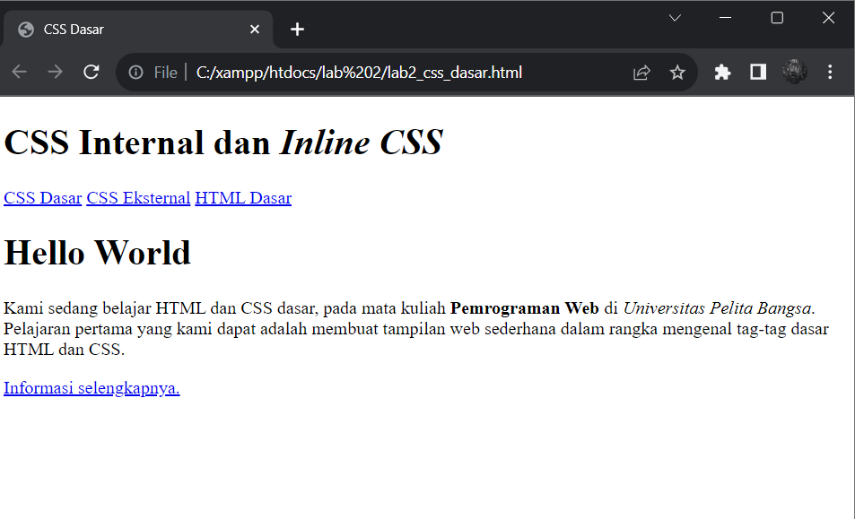
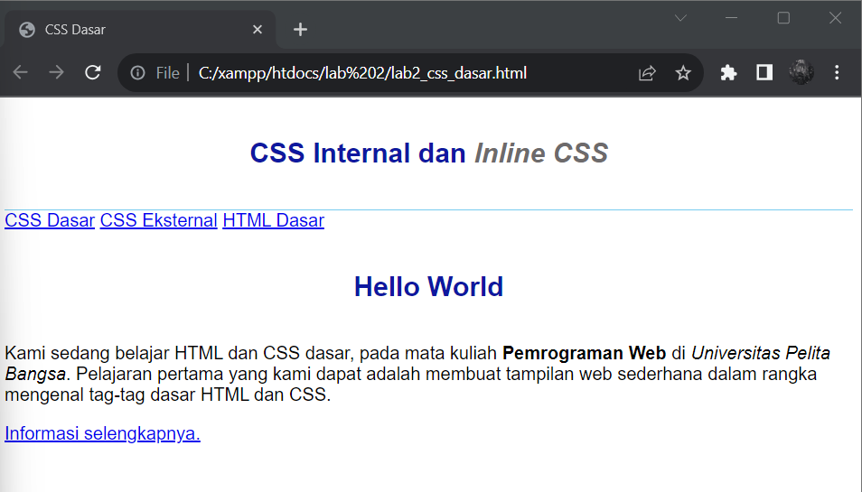
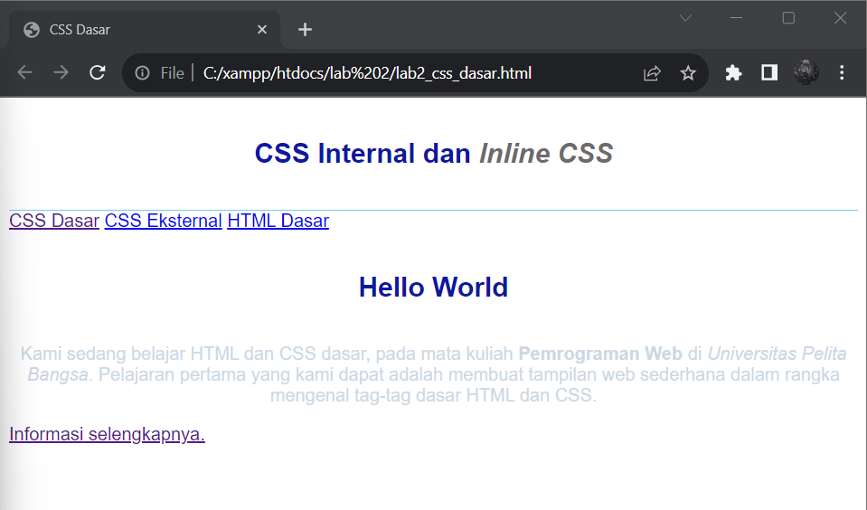
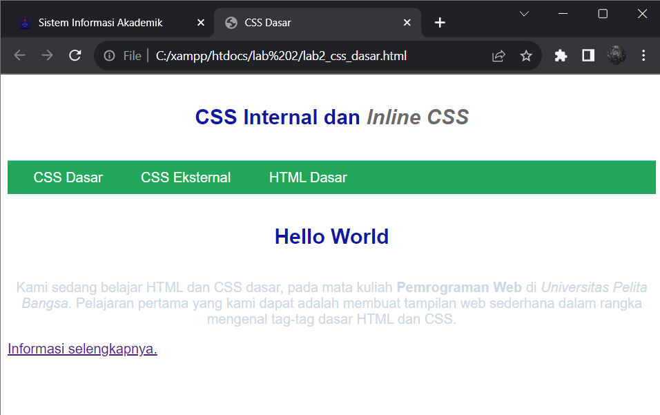
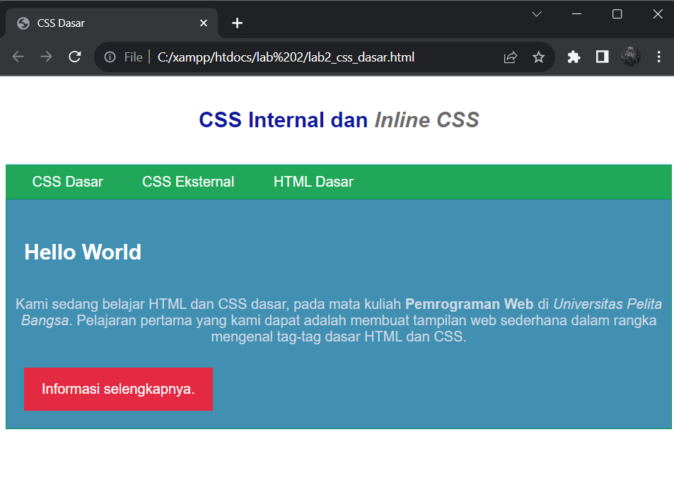

#Praktikum_web_2

`Nama  : Faizah Via Fadhillah`

`Nim   : 312210460`

`Kelas : TI22.A4`

## Pengertian CSS

    Cascading Style Sheet (CSS) merupakan aturan untuk mengatur beberapa komponen dalam sebuah
    web sehingga akan lebih terstruktur dan seragam. 
    CSS bukan merupakan bahasa pemograman. CSS memudahkan dalam mengubah tampilan di berbagai halaman. 
    Hanya dengan mengubah fungsi style di file CSS maka seluruh tampilan yang menggunakan fungsi tersebut akan berubah secara
    otomatis. 
    CSS mempunyai atribut lebih beragam dibandingkan dengan HTML CSS memungkinkan konten dapat dioptimasi di lebih dari satu perangkat. 
    Hampir seluruh website yang ada di internet menggunakan CSS di dalamnya. 
    Selain tampilannya yang lebih menarik, kebanyakan browser populer saat ini juga mendukung CSS.

## Struktur CSS

    Perintah CSS terdiri atas 2 komponen, yakni Selector & Declaration. 
    Selector berfungsi untuk memberi tahu browser bahwa pada elemen mana rule CSS diterapkan.
    Selector dapat berupa elemen HTML, selector class atau selector id. Declaration merupakan aturan CSS yang diterapkan, terdiri atas property dan value.


# Praktikum 2

1. Membuat dokumen HTML

    Script:

    ```html
    <!DOCTYPE html>
    <html lang="en">

        <head>
            <meta charset="UTF-8">
            <meta name="viewport" content="width=device-width, initial-scale=1.0">
            <title>CSS Dasar</title>
        </head>

        <body>
            <header>
                <h1>CSS Internal dan <i>Inline CSS</i></h1>
            </header>
            <nav>
                <a href="lab2_css_dasar.html">CSS Dasar</a>
                <a href="lab2_css_eksternal.html">CSS Eksternal</a>
                <a href="lab1_tag_dasar.html">HTML Dasar</a>
            </nav>
            <!-- CSS ID Selector -->
            <div id="intro">
                <h1>Hello World</h1>
                <p>Kami sedang belajar HTML dan CSS dasar, pada mata kuliah <b>Pemrograman
                Web</b> di <i>Universitas Pelita Bangsa</i>. Pelajaran pertama yang kami dapat
                adalah membuat tampilan web sederhana dalam rangka mengenal tag-tag dasar HTML
                dan CSS.</p>
                <!-- CSS Class Selector -->
                <a class="button btn-primary" href="#intro">Informasi selengkapnya.</a>
            </div>
        </body>
    </html>
    ```

    Output:

    


2. Mendeklarasikan CSS Internal

    Script:

    ```html
    <head>
        <title>CSS Dasar</title>
        <style>
        body {
        font-family:'Open Sans', sans-serif;
        }
        header {
        min-height: 80px;
        border-bottom:1px solid #77CCEF;
        }
        h1 {
        font-size: 24px;
        color: #0F189F;
        text-align: center;
        padding: 20px 10px;
        }
        h1 i {
        color:#6d6a6b;
        }
        </style>
    </head>
    ```

    Output:

    


3. Menambahkan Inline CSS

    Script:

    ```html
    <p style="text-align: center; color: #ccd8e4;">
    ```

    Output:

    


4. Membuat CSS Eksternal

* Buatlah file baru dengan nama style_eksternal.css kemudian buatlah deklarasi CSS seperti berikut.

    Script:

    ```css
    nav 
    {
        background: #20A759;
        color:#fff;
        padding: 10px;
    }
    nav a 
    {
        color: #fff;
        text-decoration: none;
        padding:10px 20px;
    }
    nav .active,
    nav a:hover 
    {
        background: #0B6B3A;

    }
    ```

* Kemudian tambahkan tag `<link>` untuk merujuk file css yang sudah dibuat pada bagian `<head>`

    Script:

    ```html
    <head>
    <!-- menyisipkan css eksternal -->
    <link rel="stylesheet" href="style_eksternal.css" type="text/css">
    </head>
    ```

    Output:

    


5. Menambahkan CSS Selector

    Script:

    ```css
        /* ID Selector */
        #intro {
        background: #418fb1;
        border: 1px solid #099249;
        min-height: 100px;
        padding: 10px;
        }
        #intro h1 {
        text-align: left;
        border: 0;
        color: #fff;
        }
        /* Class Selector */
        .button {
        padding: 15px 20px;
        background: #bebcbd;
        color: #fff;
        display: inline-block;
        margin: 10px;
        text-decoration: none;
        }
        .btn-primary {
        background: #E42A42;
        }
    ```

    Output:

    


# Pertanyaan

1. Lakukan eksperimen dengan mengubah dan menambah properti dan nilai pada kode CSS 
dengan mengacu pada CSS Cheat Sheet yang diberikan pada file terpisah dari modul ini.

    Script:

    ```css
    nav {
        background: #2C3539;
        color:#fff;
        padding: 10px;
        }

    nav a {
        color: #fff;
        text-decoration: none;
        padding:10px 20px;
        }

    nav .active,
    nav a:hover {
        background: #16F529;
        }
    /* ID Selector */
    #intro {
        background: #98AFC7;
        border: 1px solid #099249;
        min-height: 100px;
        padding: 10px;
        }
    #intro h1 {
        text-align: left;
        border: 0;
        color: #fff;
        }
        /* Class Selector */
    .button {
        padding: 15px 20px;
        background: #bebcbd;
        color: #fff;
        display: inline-block;
        margin: 10px;
        text-decoration: none;
        }
    .btn-primary {
        background: #16F529;
        }

    ```

    Output:
    


2. Apa perbedaan pendeklarasian CSS elemen h1 {...} dengan #intro h1 {...}? berikan penjelasannya!

* `h1 {...}` adalah contoh dari pendeklarasian CSS yang menggambarkan pemilihan semua elemen `h1` di seluruh halaman web kita. 
Dalam kata lain, hal ini akan memengaruhi setiap elemen `h1` yang ada di dokumen HTML kita, tanpa memandang di mana elemen-elemen tersebut berada. 
ini adalah selektor umum yang diterapkan pada semua elemen `h1`.

* `#intro h1 {...}` adalah contoh dari pendeklarasian CSS yang menggunakan kombinasi selektor ID dan elemen untuk memilih elemen `h1` yang terletak di dalam elemen dengan ID "intro". 
Ini berarti hanya elemen `h1` yang berada dalam konteks elemen dengan ID "intro" yang akan memengaruhi gaya yang didefinisikan dalam aturan CSS.


3. Apabila ada deklarasi CSS secara internal, lalu ditambahkan CSS eksternal dan inline CSS pada
elemen yang sama. Deklarasi manakah yang akan ditampilkan pada browser? Berikan
penjelasan dan contohnya!

* Ketika ada deklarasi CSS yang didefinisikan secara internal (di dalam tag style dalam dokumen HTML), 
CSS eksternal (didefinisikan di dalam file eksternal CSS yang dihubungkan dengan dokumen HTML menggunakan tag link ), 
dan juga inline CSS (didefinisikan langsung di dalam atribut style pada elemen HTML yang sama), 
maka urutan prioritas atau cascading order yang berlaku adalah sebagai berikut:

    - Deklarasi Inline: Inline CSS yang didefinisikan secara langsung pada elemen HTML memiliki tingkat spesifikasi yang paling tinggi. 
    Oleh karena itu, deklarasi inline akan selalu menggantikan deklarasi lainnya jika ada konflik.

    - Deklarasi Eksternal: CSS yang didefinisikan dalam file eksternal (dengan menggunakan tag <link> atau <style> di bagian <head> dokumen HTML).
    memiliki tingkat spesifikasi di antara deklarasi internal dan inline. Ini akan digunakan jika tidak ada deklarasi inline.

    - Deklarasi Internal: CSS yang didefinisikan di dalam tag <style> di bagian <head> dokumen HTML 
    memiliki tingkat spesifikasi yang lebih tinggi daripada 
    deklarasi eksternal, tetapi lebih rendah daripada inline.